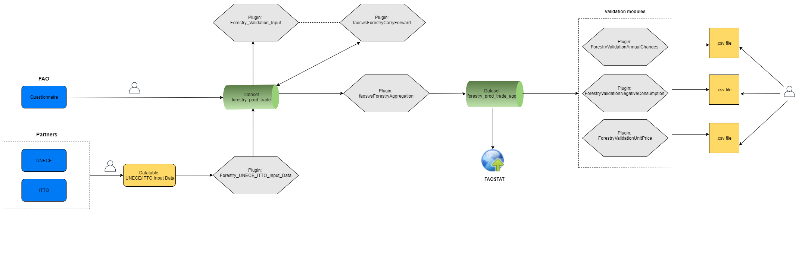

# **Forestry Production and Trade - Framework** {#ForestryFramework}

This book focuses on the migration of the Forestry Production and Trade statistical processes to SWS. Therefore, it is important to provide an overview of the statistical value chain carried by FOA. The next sections summarize the Forestry Production and Trade data collection and information management methodology.

```{r  forestryWorkflow, echo=FALSE, out.width="100%", fig.align="center", fig.show='hold', fig.cap='Workflow of the Forestry Production and Trade process'}


```


## **Data Collection**
The Forestry Production and Trade data collection relies on the [Joint Forestry Sector Questionnaire distpatch](http://www.fao.org/forestry/statistics/jfsq/en/). The dispatch of the [same harmonized questionnaire](http://www.fao.org/forestry/statistics/jfsq/en/) is carried out by FAO by its international partners:
  
- **ITTO** : The [International Tropical Timber Organization](https://www.itto.int/)
- **Eurostat** : The [European Statistics](https://ec.europa.eu/eurostat)
- **UNECE** : The [United Nations Economic Comission for Europe](http://www.unece.org/info/ece-homepage.html)
  
<!--```{r tabCountryPartners, echo=FALSE, message=FALSE}
suppressWarnings({
require(data.table)
require(kableExtra)
})
d = data.table::fread("tables/countries_partners.csv")
knitr::kable(d,
             caption = paste("Joint questionnaire dispatch task force for Forestry Production and Trade data collection."),
             booktabs = TRUE) %>%
kableExtra::kable_styling(font_size = 12)
```-->
  

FAO sends questionnaires to countries in May/June and the deadline for the first response is September 1st. The partners send out questionnaires between April and June and FAO receives validated data from partners from July to November.

## **Entering Data**

Both  data coming from either questionnaires or FAO partners are entered in the SWS by the user through csv files. Once the data are in the system, a validation procedure takes place.

## **Aggregates**

Once the data has been validated, the user is ready to go ahead and generate the aggregates through the module **faoswsForestryAggregation**. More information about this module is found in the chapter \@ref(faoswsForestryAggregation).

## **Validation/Dissemination**

After calculating the aggregates, three modules are ran in order to perform other kinds of validation (annual changes, negative consumption and unit value). More information about these modules are found in the chapters \@ref(ForestryValidationAnnualChanges), \@ref(ForestryValidationNegativeConsump) and \@ref(ForestryValidationUnitPrice). 
After the step validation, the FOA unit responsible for Forestry Production and Trade can disseminate the data in the FAOSTAT.


