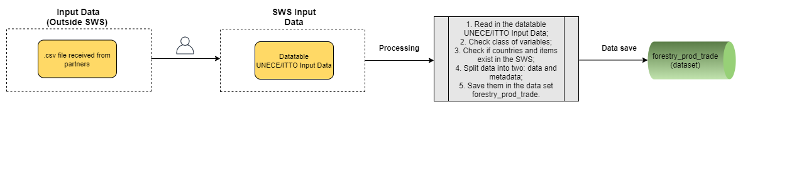
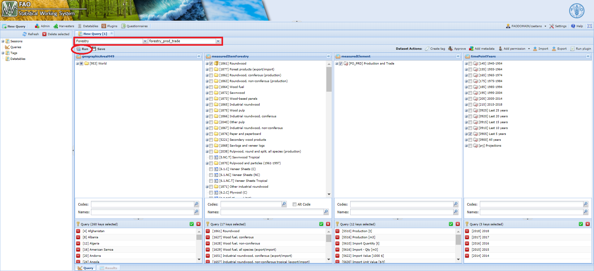

# **The Forestry_UNECE_ITTO_Input_Data module** {#ForestryUNECEITTOInputData}

The **Forestry_UNECE_ITTO_Input_Data** module is essentially a data harvester. It pulls the raw data provided by partners from the datatable `UNECE/ITTO Input Data` and coverts it into a SWS-compliant dataset format. The module deals not only with the data itself, but also with the metadata available. 
It is important to note that, while the process described above is automated, the user must upload the *.csv* file format to the datatable `UNECE/ITTO Input Data`.


```{r  forestryInputData, echo=FALSE, out.width="100%", fig.align="center", fig.show='hold', fig.cap='Workflow of the Forestry_UNECE_ITTO_Input_Data module'}


```

## **Steps**

The module is straightforward as it checks if the data for countries/items coming from the input data does exist in the **forestry_prod_trade** dataset.

 To do so, the module checks the code lists for countries (**geographicAreaM49**) and for items (**measuredItemForestry**) as they are used to build the forestry data set. In case there is any inconsistency, a message will pop up in the system warning the user and a input data validation will be needed. 
 
 
## **Running the module**

1. Log in the SWS;

2. Click on **New Query**;

3. Select **Forestry domain** and **forestry_prod_trade dataset**;

4. Select whatever geographicAreaM49, measuredElement, measuredItemForestry and timePointYears. After that, run the query;
<br>
```{r queryUneceItto,  echo=FALSE, out.width="100%",fig.align="center",  fig.cap='Steps 1 to 4'}

```
<br>
5. Click on **Run plugin** on the top-right;

6. Select the **Forestry_UNECE_ITTO_Input_Data** module, choose the *parameters* (Start and End year) and click on **Run plugin**;

<br>
```{r UneceIttoPlugin,  echo=FALSE, out.width="100%", fig.align="center", fig.cap='Select the Forestry_UNECE_ITTO_Input_Data plugin and run it'}
knitr::include_graphics("images/forestry_select_plugin_unece_itto_input_data.png")
```
<br>
7. Wait for the results to appear in the session;
<br>
8. Click on **Save to dataset**.

