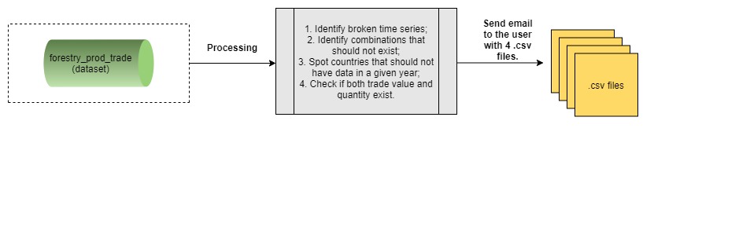

# **The Forestry_Validation_Input module** {#ForestryValidationInput}

The **Forestry_Validation_Input** module aims to validate the input data used to calculate aggregates. It plays an important role in detecting inconsistency, if any, as this is the precedent step before the aggregates.


```{r  forestryInputDataValidation, echo=FALSE, out.width="85%", fig.align="center", fig.show='hold', fig.cap='Workflow of the Forestry_Validation_Input module'}


```


## **Steps**

This plugin will be ran over the dataset **forestry_prod_trade** doing the following checks: 

- check and identify broken series (e.g. the country A has data for item I and element E for 1961, 1962, 1963, 1965. In this example, there's a break in the series in 1964);
- check and identify combinations that cannot exist (based on the the datatable `Forestry Product Aggregation Elements`); 
- spot countries that should not have data in a given year;
- check inconsistency in the trade data (e.g. if both trade value and quantity exist).

An email will be sent to the user with the four outputs above. This plugin should be tested before the aggregation step. If there's no problem in the dataset, the data is ready to be used as an input to calculate the aggregates.

## **Running the module**

1. Log in the SWS;

2. Click on **New Query**;

3. Select **Forestry domain** and **forestry_prod_trade dataset**;

4. Select whatever geographicAreaM49, measuredElement, measuredItemForestry and timePointYears. After that, run the query;
<br>
```{r queryForestryprodtrade,  echo=FALSE, out.width="100%",fig.align="center",  fig.cap='Steps 1 to 4'}
knitr::include_graphics("images/query_forestry_unece_itto_input_data_plugin.PNG")
```
<br>
5. Click on **Run plugin** on the top-right;

6. Select the **Forestry_Validation_Input** module, choose the *parameters* (Start and End year) and click on **Run plugin**;

<br>
```{r InputValidationPlugin,  echo=FALSE, out.width="100%", fig.align="center", fig.cap='Select the Forestry_Validation_Input plugin and run it'}
knitr::include_graphics("images/forestry_input_validation_plugin.png")
```
<br>
7. Wait for the results to appear in the session;
<br>
8. Click on **Save to dataset**.

