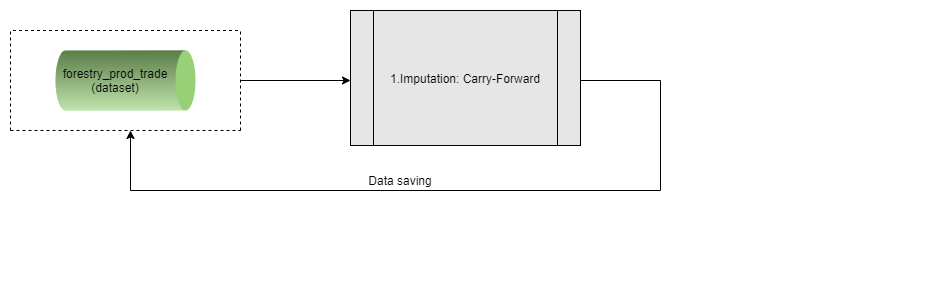

# **The faoswsForestryCarryForward module** {#ForestryCarryForward}


A step right before calculating the aggregates is to *Carry-Forward* the input data (**forestry_prod_trade** dataset). This step is paramount while the *new data* coming from partners and questionnaires do not arrive. Thus, the whole process does not get stuck and the aggregates are calculated. 


```{r  forestryCarryForward, echo=FALSE, out.width="85%", fig.align="center", fig.show='hold', fig.cap='Workflow of the faoswsForestryCarryForward module'}


```

## **Steps**

The module is straightforward as it just imputes data by the carry-forward method. The module is smart enough to inform the user in case there is already data for the chosen year or if the year in question is too far from the last available year with data.


## **Running the module**

1. Log in the SWS;

2. Click on **New Query**;

3. Select **Forestry domain** and **forestry_prod_trade dataset**;

4. Select whatever geographicAreaM49, measuredElement, measuredItemForestry and timePointYears. After that, run the query;
<br>
```{r queryCarryForward,  echo=FALSE, out.width="100%",fig.align="center",  fig.cap='Steps 1 to 4'}
knitr::include_graphics("images/query_forestry_unece_itto_input_data_plugin.PNG")
```
<br>
5. Click on **Run plugin** on the top-right;

6. Select the **faoswsForestryCarryForward** module, choose the *parameter* (Year to impute) and click on **Run plugin**;

<br>
```{r CarryForwardPlugin,  echo=FALSE, out.width="100%", fig.align="center", fig.cap='Select the faoswsForestryCarryForward plugin and run it'}
knitr::include_graphics("images/carry_forward_plugin.png")
```
<br>
7. Wait for the results to appear in the session;
<br>
8. Click on **Save to dataset**.


