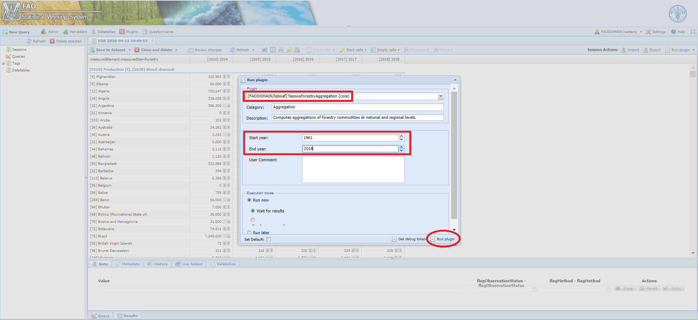

# **The faoswsForestryAggregation module** {#faoswsForestryAggregation}

<!--The module **faoswsForestryAggregation** is essentially a validation tool which is used by the the technical unit to check the effects of data changes in the forestry_prod_trade data set on geographical and commodity aggregations.-->

The module **faoswsForestryAggregation** comprehend the main step in the *Forestry Production and Trade* process as it calculates the agrgegates by region and item that will be disseminated through **Faostat**.

```{r  faoswsForestryAggregationWorkflow, echo=FALSE, out.width="85%", fig.align="center", fig.show='hold', fig.cap='Workflow of the faoswsForestryAggregation module'}
knitr::include_graphics("images/faoswsForestryAggregation.png")

```

## **Steps**

The module can be basically split into four parts as below.

### **Read in the data**
The module uses the **forestry_prod_trade** dataset as input. According to the technical unit, they will be constantly changing this dataset throughout the data cycle, specially when new data come in or the officers decide to make changes based on their domain knowledge. 


### **Get regional aggregation**
After reading in the input dataset, the module geographically aggregates the primary commodities based on FAOSTAT - UNSD M49 mapping. Please, for a full representation of this table consult either the Appendix \@ref(tab:m49fsisomapping) or [this link](http://www.fao.org/faostat/en/#data/FO).


### **Get Forestry commodity aggregation**
Once a data set with regional aggregate is ready, the module moves to producing commodity aggregations at the national and regional levels. <!--Before the aggregations, the modules filters out all commodity groups and analytical elements (Export and Import unit values) so that they can be recalculated. -->
Since there is an interplay between commodity groups, the module carries the aggregation in tandem, with four commodity groups being aggregated first and then rest of aggregates. 

```{r tab1, echo=FALSE, message=FALSE}
suppressWarnings({
require(data.table)
require(kableExtra)
})
d <- data.table::fread("tables/aggregation_tree.csv")
d <- d[CommodityGroup %in% c(1681, 1656, 1674, 1675)]
knitr::kable(d,
             caption = paste("First commodity groups to be calculated by the faoswsForestryAggregation module"),
             booktabs = TRUE) %>%
  row_spec(0, background = "#a9c9a7") %>% 
  kableExtra::kable_styling(font_size = 12)
```
<br>

### **Get Unit values**
Once the import and export figures are calculated for values and quantity, the unit price, which is the quotient between values and quantity, can be easily calculated for both primary and group commodities at the national and regional levels. 
<br>

### **Get back the original flags** 
With unit values already in the data sets (national and regional), the last step is to recovery the flags from the original input. Data records added during the processing come either from geographic or commodity aggregation. Therefore, these records have  **"E"** (Aggregation) as flagObservationStatus and **"s"** (summation) as flagMethod. 
<br>

### **Convert FAOSTAT regions to SWS regions**
The processed regional data set uses FAOSTAT codes for regions. To be able to save the results in the SWS, regions must be converted to SWS regional codes compatible with the **geographicAreaM49** in the **forestry_prod_trade_agg** dataset. For this, the module uses the following function.

### **Binding national and regional data**

Binding national and regional data sets.
<!--```{r, eval=FALSE}
data_all <- rbind(pivot_national_flags, pivot_regional_flags_sws)
data_all <- data_all[, Value := round(Value, 1)][order(geographicAreaM49, measuredItemForestry, measuredItemForestry)]
data_all <- data_all[, lapply(.SD, as.character)]
data_all$Value <- as.numeric(data_all$Value)
data_all <- data_all[complete.cases(data_all), ]
```-->

### **Compare before and after aggregations**
As a validation tool, the faoswsForestryAggregation module also needs to return what has changed from the input dataset. The module flags values where the absolute difference between the input dataset and the aggregate dataset is higher than 0.1.
<br>

### **Save data in the SWS Share Drive and database**
The data with primary and grouped commodities at the national and regional levels can be accessed by the user as a csv file in the [SWS shared drive](file://hqlprsws1.hq.un.fao.org/sws_r_share/ForestryProdAndTrade/output/faoswsForestryAggregation/). The full data is saved in the folder **ForestryProdAndTrade -> output -> faoswsForestryAggregation -> results**, whereas the comparison csv file is saved in the folder **ForestryProdAndTrade -> output -> faoswsForestryAggregation -> comparisons**. Every time the module runs these files are updated.
In the SWS - database, the data is found in the dataset **forestry_prod_trade_agg**.


## **Running the module**


1. Log in the SWS;

2. Click on **New Query**;

3. Select **Forestry domain** and **forestry_prod_trade_agg dataset**;

4. Select whatever geographicAreaM49, measuredElement, measuredItemForestry and timePointYears. After that, run the query;
<br>
```{r queryAggregates,  echo=FALSE, out.width="100%",fig.align="center",  fig.cap='Steps 1 to 4'}
knitr::include_graphics("images/forestry_prod_trade_agg_query.PNG")
```
<br>

5. Select the **faoswsForestryAggregation** module, choose the *parameters* (Start and End year) and click on **Run plugin**;

<br>
```{r AggregatePlugin,  echo=FALSE, out.width="100%", fig.align="center", fig.cap='Select the faoswsForestryAggregation plugin and run it'}

```
<br>
6. Wait for a window message to appear in the session: **ForestryAggregation module ran successfully!!!**;
<br>
7. Click on **Save to dataset**.
