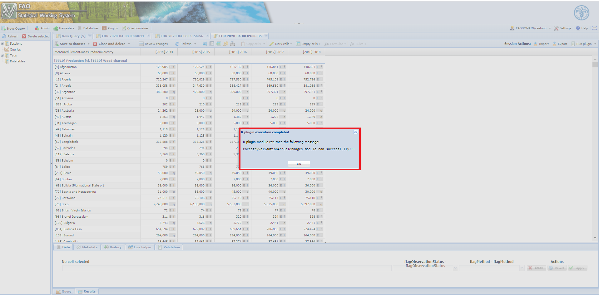
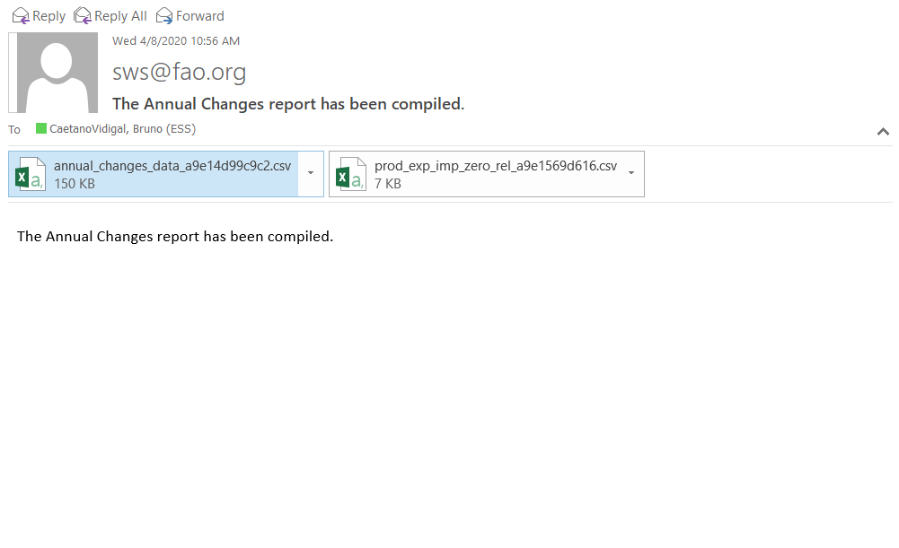

# **The ForestryValidationAnnualChanges module** {#ForestryValidationAnnualChanges}

The module **ForestryValidationAnnualChanges** pulls out records with significant abnormal high annual changes on production, imports and exports according to parameters set by the user.

```{r  forestryAnnualChanges, echo=FALSE, out.width="85%", fig.align="center", fig.show='hold', fig.cap='Workflow of the ForestryValidationAnnualChanges module'}
knitr::include_graphics("images/ForestryValidationAnnualChanges.png")

```


## **Steps**


The module applies simple check in the data. Basically it does the following.

### Read in data

The module reads data from **forestry_prod_trade_agg** dataset and from the datatables listed in the figure \@ref(fig:ForestryValidationUnitPriceWorkflow).

### Data filtering

After pulling the needed data, the module applies filters using the parameters chosen by the user accordingly. The module has two kinds of parameters:

- time range (*start* and *end* year of the process) - **Start year** and **End year**;
- quantity threshold (minimum quantity analysed) - **Production Qty threshold**.
- percentage change - **Percentage Change**.


### Annual Change check

At this stage, there are only the target data as the time range and quantity threshold were applied. Therefore, the module verifies if within the remaining data there is any item with an percentage annual change beyond its limits. 

### Email the user

The final step of this module is to email the user with the output.


## **Running the module**

1. Log in the SWS;

2. Click on **New Query**;

3. Select **Forestry domain** and **forestry_prod_trade_agg dataset**;

4. Select whatever geographicAreaM49, measuredElement, measuredItemForestry and timePointYears. After that, run the query;
<br>
```{r queryAnnualChanges,  echo=FALSE, out.width="100%",fig.align="center",  fig.cap='Steps 1 to 4'}
knitr::include_graphics("images/forestry_prod_trade_agg_query.PNG")
```
<br>

5. Select the **ForestryValidationAnnualChanges** module, choose the *parameters* (Start and End year ; Percentage change ; Production Qty threshold) and click on **Run plugin**;

<br>
```{r AnnualChangesPlugin,  echo=FALSE, out.width="100%", fig.align="center", fig.cap='Select the ForestryValidationAnnualChanges plugin and run it'}
knitr::include_graphics("images/annual_changes_parameters.png")
```
<br>
6. Wait for a window message to appear in the session;
<br>
```{r AnnualChangesPluginResults,  echo=FALSE, out.width="100%", fig.align="center", fig.cap='ForestryValidationAnnualChanges module ran successfully'}

```

7. Get your results sent by email.
```{r AnnualChangesPluginEmail,  echo=FALSE, out.width="80%", fig.align="center", fig.cap='Email sent to the user with results'}

```
