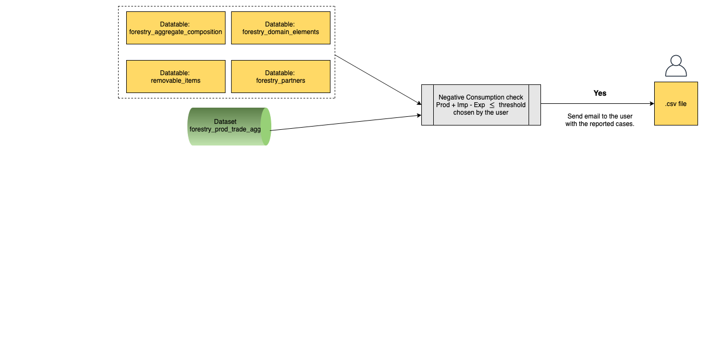
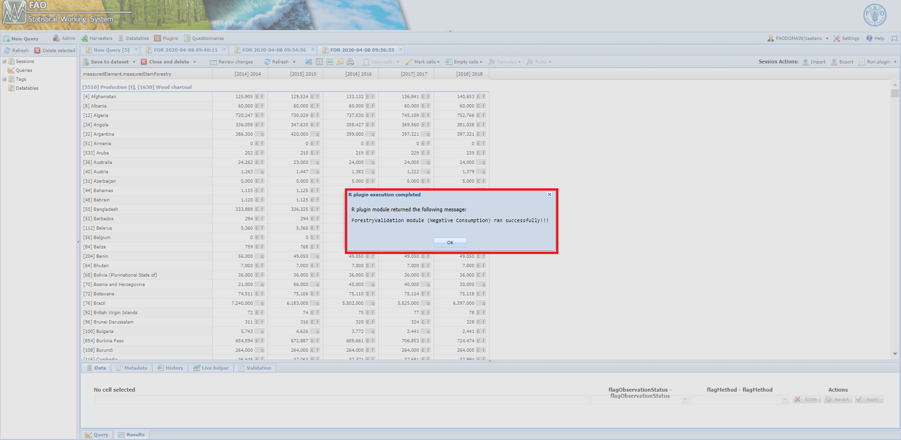
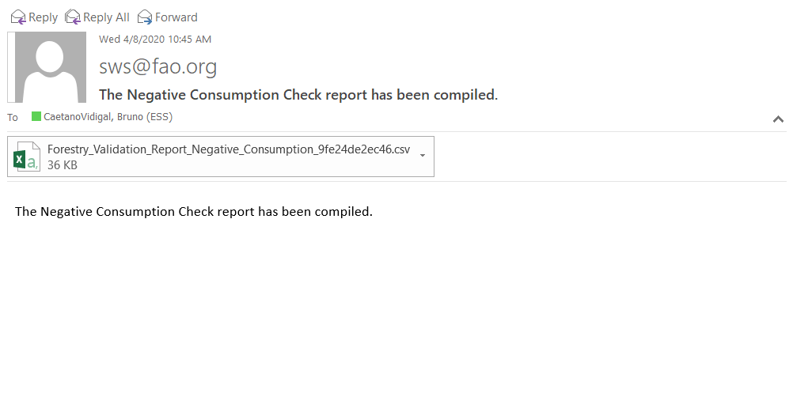

# **The ForestryValidationNegativeConsump module** {#ForestryValidationNegativeConsump}

The module **ForestryValidationNegativeConsump** is part of the validation procedure before dissemination. As per its name, it carries data validation on the negative consumption, if any. It is up to the user decides the parameters to be used in this phase.


```{r  ForestryValidationNegativeConsumpWorkflow, echo=FALSE, out.width="85%", fig.align="center", fig.show='hold', fig.cap='Workflow of the ForestryValidationNegativeConsump module'}


```

## **Steps**

The module can be basically split into four parts as below.

### Read in data

The module reads data from **forestry_prod_trade_agg** dataset and from the datatables listed in the figure \@ref(fig:ForestryValidationNegativeConsumpWorkflow).

### Data filtering

After pulling the needed data, the module applies filters using the parameters chosen by the user accordingly. The module has two kinds of parameters:

- time range (*start* and *end* year of the process) - **Start year** and **End year**;
- negative consumption threshold - **Negative consumption threshold**. For instance, in this case if the user chooses `-1000`, the module will filter the time series that contain at least one data point with a `Consumption <= -1000`. For the sake of clarification, Consumption is definied as below:

  -  **Consumption = Production + Imports - Exports**


### Negative consumption check

At this stage, the module performs the *Negative Consumption* check over the data by using the parameter chosen by the user.

### Email the user

The final step of this module is to email the user with one *.csv* file - negative consumption report.


## **Running the module**

1. Log in the SWS;

2. Click on **New Query**;

3. Select **Forestry domain** and **forestry_prod_trade_agg dataset**;

4. Select whatever geographicAreaM49, measuredElement, measuredItemForestry and timePointYears. After that, run the query;
<br>
```{r queryNegConsump,  echo=FALSE, out.width="100%",fig.align="center",  fig.cap='Steps 1 to 4'}
knitr::include_graphics("images/forestry_prod_trade_agg_query.PNG")
```
<br>

5. Select the **ForestryValidationNegativeConsump** module, choose the *parameters* (Start and End year ; Negative Consumption threshold) and click on **Run plugin**;

<br>
```{r NegConsumpPlugin,  echo=FALSE, out.width="100%", fig.align="center", fig.cap='Select the ForestryValidationNegativeConsump plugin and run it'}
knitr::include_graphics("images/negative_comsumption_parameters.png")
```
<br>
6. Wait for a window message to appear in the session;
<br>
```{r negConsumpPluginResults,  echo=FALSE, out.width="100%", fig.align="center", fig.cap='ForestryValidationNegativeConsump module ran successfully'}

```

7. Get your results sent by email.
```{r NegConsumpPluginEmail,  echo=FALSE, out.width="80%", fig.align="center", fig.cap='Email sent to the user with results'}

```


