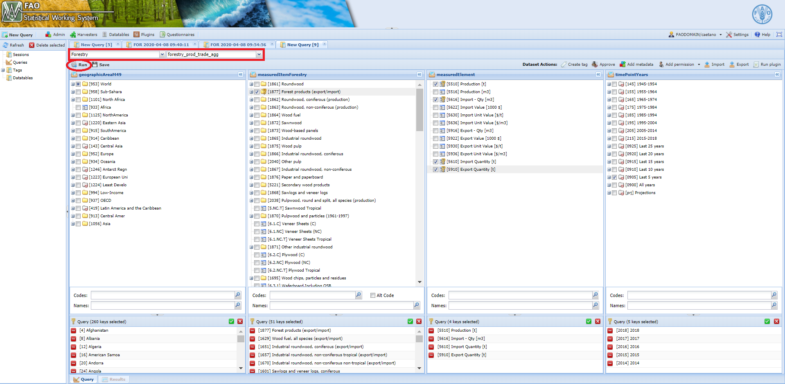

# **The ForestryValidationUnitPrice module** {#ForestryValidationUnitPrice}

The module **ForestryValidationUnitPrice** pulls out records with significant abnormal high or low import/export unit price, given a threshold (*quantity*) set by the user.


```{r  ForestryValidationUnitPriceWorkflow, echo=FALSE, out.width="100%", fig.align="center", fig.show='hold', fig.cap='Workflow of the ForestryValidationUnitPrice module'}
knitr::include_graphics("images/ForestryValidationUnitPrice.png")

```

## **Steps**

The module can be basically split into four parts as below.

### Read in data

The module reads data from **forestry_prod_trade_agg** dataset and from the datatables listed in the figure \@ref(fig:ForestryValidationUnitPriceWorkflow).

### Data filtering

After pulling the needed data, the module applies filters using the parameters chosen by the user accordingly. The module has two kinds of parameters:

- time range (*start* and *end* year of the process) - **Start year** and **End year**;
- trade quantity threshold (minimum trade quantity analysed) - **Export Qty threshold** and **Import Qty threshold**.


### Unit Price check

At this stage, there are only the target data as the time range and trade quantity threshold were applied. Therefore, the module verifies if within the remaining data there is any item with a unit price beyond its limits. Please, see the datatable [Trade outlier tresholds] for more information on the limits by each item or go access it in the SWS.  

### Email the user

The final step of this module is to email the user with two *.csv* files - unit price for imports and exports.

 
## **Running the module**

1. Log in the SWS;

2. Click on **New Query**;

3. Select **Forestry domain** and **forestry_prod_trade_agg dataset**;

4. Select whatever geographicAreaM49, measuredElement, measuredItemForestry and timePointYears. After that, run the query;
<br>
```{r queryUnitPrice,  echo=FALSE, out.width="100%",fig.align="center",  fig.cap='Steps 1 to 4'}

```
<br>

5. Select the **ForestryValidationUnitPrice** module, choose the *parameters* (Start and End year ; Imports and Exports Quantity thresholds) and click on **Run plugin**;

<br>
```{r UnitPricePlugin,  echo=FALSE, out.width="100%", fig.align="center", fig.cap='Select the ForestryValidationUnitPrice plugin and run it'}

```
<br>
6. Wait for a window message to appear in the session;
<br>
```{r UnitPricePluginResults,  echo=FALSE, out.width="100%", fig.align="center", fig.cap='ForestryValidationUnitPrice module ran successfully'}

```

7. Get your results sent by email.
```{r UnitPricePluginEmail,  echo=FALSE, out.width="80%", fig.align="center", fig.cap='Email sent to the user with results'}

```


