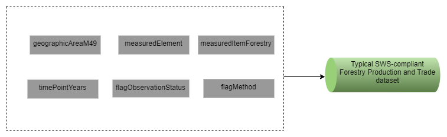

# (APPENDIX) Appendix {-}

# SWS resources

SWS resources are R modules, data tables, data sets, and code lists comprising a migration framework. Data tables are typically used as auxiliary data to help R modules to achieve their goals. The statistical domains in SWS, through code/reference lists, define the dimensions of the datasets. Therefore, datasets are primarily used to store code list - referenced values as either input and output in the SWS. 

## Code lists

Code lists, also called reference lists in SWS parlance, are the dimensions making up the data sets that are designed by the user to store analytical results from SWS modules. The dimensions are statistical-domain-specific and are defined by the technical unit to reflect its needs regarding data collection, processing, and dissemination while meeting FAO standards. Each data set dimension has a set of codes and their associated descriptions. Thus, code lists serve to the purpose of standardization, visualization, and metadata by associating standardized codes to standardized names in the SWS data set outputs. A typical SWS compliant data set has, therefore, the following dimensions/reference lists:


- **Geographic area**. Representing a spatial scale the information is measured at. For example, countries, territories, regional aggregates, regional special groups aggregates, global aggregates. In SWS, the geographic area dimension used by Forestry Production and Trade data sets is named **geographicAreaM49**.

- **Items**. Those one wants to take a measurement from. For example, commodities, commodity groups, land use types, species, etc. Typical item dimension names are **measuredItemCPC**, ***measuredItemHS**, **measuredItem**. In SWS, the item dimension used by Forestry Production and Trade data sets is named **measuredItemForestry**.

```{r measuredItemForestry, echo=FALSE, message=FALSE}

require(data.table)
require(kableExtra)

d = data.table::fread("tables/items_forestry.csv")
knitr::kable(d,
             caption = paste("Forestry commodity codes in the measuredItemForestry code list."),
             booktabs = TRUE) %>%
  row_spec(0, background = "#a9c9a7") %>% 
  kableExtra::kable_styling(font_size = 12)
```


- **Elements**. Often representing a measurement  that can be taken across different items. For example, area, production, share. In SWS, the element dimension/code list used by Forestry Production and Trade is **measuredElement**. 

- **Time** (the time unit the data is displayed for: year, months, etc). In SWS, the time dimension used by Forestry Production and Trade data sets is named **timePointYears**.

- **Flag** (A standardized label indicating origin and/or nature of a number in the data set, e.g. <blank> (Official number)). In SWS, the flag dimension used by Forestry Production and Trade data sets is named **flagObservationStatus**. Please check the [OCS statistical standards](http://intranet.fao.org/statistics_coordination_portal/standards_for_quality_compliance/) and the [flags document](http://intranet.fao.org/fileadmin/user_upload/scp/Standards_for_quality_compliance/SSS_Observation_Status_Codes__Flags__endorsed__December_2016_.pdf ) to understand the flagObservationStatus rational and  obtain the description of flags. 
<br>


```{r tabFlagObservationStatus, echo=FALSE, message=FALSE}
require(data.table)
require(kableExtra)
d = data.table::fread("tables/flagObservationStatus.csv")
knitr::kable(d, 
             align = 'l',
             # escape = T, 
             # format = "html",
             # table.attr='class="table-fixed-header"',
             caption = "Observation Status Flags Annotations") %>%
  row_spec(0, background = "#a9c9a7") %>% 
  kableExtra::kable_styling(font_size = 14) %>% 
  kable_styling(fixed_thead = T) 
  
```


<br>
- **Method** (A standardized label indicating method utilized to obtain a number in the data set. In SWS, the method dimension used by Forestry Production and Trade data sets is named **flagMethod**. Please check the [OCS statistical standards](http://intranet.fao.org/statistics_coordination_portal/standards_for_quality_compliance/) and the [flags document](http://intranet.fao.org/fileadmin/user_upload/scp/Standards_for_quality_compliance/SSS_Observation_Status_Codes__Flags__endorsed__December_2016_.pdf ) to understand the flagMethod rational and  obtain the description of flags. 

```{r tabFlagMethod, echo=FALSE, message=FALSE}
require(data.table)
require(kableExtra)
d = data.table::fread("tables/flagMethod.csv")
knitr::kable(d, 
             align = 'l',
             # escape = T, 
             # format = "html",
             # table.attr='class="table-fixed-header"',
             caption = "Method flags") %>%
 row_spec(0, background = "#a9c9a7") %>% 
  kableExtra::kable_styling(font_size = 14) %>% 
  kable_styling(fixed_thead = T) 
  
```

<br>

The Forestry flags were mapped out into the SWS flag system as below:

```{r flagMappedOut, echo=FALSE, message=FALSE}
suppressWarnings({
require(data.table)
require(kableExtra)
})
d = suppressWarnings(data.table::fread("tables/flag_conversion.csv"))
knitr::kable(d,
             caption = paste("FAOSTAT-SWS mapping for observations and methods in Forestry Production and Trade."),
             booktabs = TRUE) %>%
  row_spec(0, background = "#a9c9a7") %>% 
  kableExtra::kable_styling(font_size = 12)
```


```{r  fig4, echo=FALSE, out.width="65%", fig.align="center", fig.show='hold', fig.cap='Typical dimensions (SWS code/reference lists) composing a Forestry Production and Trade SWS - compliant input/output dataset'}


```

<br> 

## Datatables

Datatables are mainly used to store information helping R modules to output analytical results. Information in datatables can be of a number of types. For example, conversion factors, arithmetic formulas, mapping between flags, mapping between international classifications, etc. In SWS hierarchy, all data tables reside in a given statistical domain. 
Variable names (aka column names) in SWS Datatables are more flexible in terms of the names they can take than SWS datasets. One can find SWS Datatables naming variables as element_code, element_code_sws, element_code_faostat, etc. Likewise, columns describing countries across different data tables may have different classification systems. This flexibility in Datatables is beneficial as it allows to accommodate different auxiliary information. 
In the Forestry Production and Trade framework, the data tables are in the **Forestry domain**. Below is a list of current available and filled data tables in the Forestry domain.


## Forestry Product Aggregation Elements {-}

- **Datatable:** `Forestry Product Aggregation Elements`
- **Domain:** Forestry
- **Usage:** 


```{r forestryproductaggregationelements, echo=FALSE, message=FALSE}
require(data.table)
require(kableExtra)
d = data.table::fread("tables/forestry_product_aggregation_elements.csv")
knitr::kable(d, 
             align = 'l',
             # escape = T, 
             # format = "html",
             # table.attr='class="table-fixed-header"',
             caption = "Columns description of the data table: Forestry Product Aggregation Elements") %>%
  row_spec(0, background = "#a9c9a7") %>% 
  kableExtra::kable_styling(font_size = 14) %>% 
  kable_styling(fixed_thead = T) 
  
```

## Forestry Product Aggregation Tree {-}

- **Datatable:** `Forestry Product Aggregation Tree`
- **Domain:** Forestry
- **Usage:** A data table with group commodity and their primary commodities


```{r forestryproductaggregationtree, echo=FALSE, message=FALSE}
require(data.table)
require(kableExtra)
d = data.table::fread("tables/forestry_product_aggregation_tree.csv")
knitr::kable(d, 
             align = 'l',
             # escape = T, 
             # format = "html",
             # table.attr='class="table-fixed-header"',
             caption = "Columns description of the data table: Forestry Product Aggregation Tree") %>%
  row_spec(0, background = "#a9c9a7") %>% 
  kableExtra::kable_styling(font_size = 14) %>% 
  kable_styling(fixed_thead = T) 
  
```

## Forestry Aggregate Composition {-}

- **Datatable:** `forestry_aggregate_composition`
- **Domain:** Forestry
- **Usage:** 


```{r forestryaggregatecomposition, echo=FALSE, message=FALSE}
require(data.table)
require(kableExtra)
d = data.table::fread("tables/forestry_aggregate_composition.csv")
knitr::kable(d, 
             align = 'l',
             # escape = T, 
             # format = "html",
             # table.attr='class="table-fixed-header"',
             caption = "Columns description of the data table: forestry_aggregate_composition") %>%
  row_spec(0, background = "#a9c9a7") %>% 
  kableExtra::kable_styling(font_size = 14) %>% 
  kable_styling(fixed_thead = T) 
  
```

## Forestry Countries Partners {-}

- **Datatable:** `forestry_country_partners`
- **Domain:** Forestry
- **Usage:** 


```{r forestrycountrypartners, echo=FALSE, message=FALSE}
require(data.table)
require(kableExtra)
d = data.table::fread("tables/forestry_country_partners.csv")
knitr::kable(d, 
             align = 'l',
             # escape = T, 
             # format = "html",
             # table.attr='class="table-fixed-header"',
             caption = "Columns description of the data table: forestry_country_partners") %>%
  row_spec(0, background = "#a9c9a7") %>% 
  kableExtra::kable_styling(font_size = 14) %>% 
  kable_styling(fixed_thead = T) 
  
```

## Forestry Domain Elements {-}

- **Datatable:** `forestry_domain_elements`
- **Domain:** Forestry
- **Usage:** An SWS data table storing relevant Forestry elements and used to filter input dataset.


```{r forestrydomainelements, echo=FALSE, message=FALSE}
require(data.table)
require(kableExtra)
d = data.table::fread("tables/forestry_domain_elements.csv")
knitr::kable(d, 
             align = 'l',
             # escape = T, 
             # format = "html",
             # table.attr='class="table-fixed-header"',
             caption = "Columns description of the data table: forestry_domain_elements") %>%
  row_spec(0, background = "#a9c9a7") %>% 
  kableExtra::kable_styling(font_size = 14) %>% 
  kable_styling(fixed_thead = T) 
  
```

## FS M49 regions {-}

- **Datatable:** `fs_m49_regions`
- **Domain:** Forestry
- **Usage:** 


```{r fsm49regions, echo=FALSE, message=FALSE}
require(data.table)
require(kableExtra)
d = data.table::fread("tables/fs_m49_regions.csv")
knitr::kable(d, 
             align = 'l',
             # escape = T, 
             # format = "html",
             # table.attr='class="table-fixed-header"',
             caption = "Columns description of the data table: fs_m49_regions") %>%
  row_spec(0, background = "#a9c9a7") %>% 
  kableExtra::kable_styling(font_size = 14) %>% 
  kable_styling(fixed_thead = T) 
  
```


## M49 FS ISO Mapping {-}

- **Datatable:** `m49_fs_iso_mapping`
- **Domain:** Common Domain
- **Usage:** An SWS dataset data table storing the mapping between FAOSTAT and UNSD M49 codes used to carry geographic aggregations. 

```{r m49fsisomapping, echo=FALSE, message=FALSE}
require(data.table)
require(kableExtra)
d = data.table::fread("tables/m49_fs_iso_mapping_colnames.csv")
knitr::kable(d, 
             align = 'l',
             # escape = T, 
             # format = "html",
             # table.attr='class="table-fixed-header"',
             caption = "Columns description of the data table: m49_fs_iso_mapping") %>%
  row_spec(0, background = "#a9c9a7") %>% 
  kableExtra::kable_styling(font_size = 14) %>% 
  kable_styling(fixed_thead = T) 
  
```


## Trade outlier tresholds {-}

- **Datatable:** `Trade outlier tresholds`
- **Domain:** Forestry
- **Usage:** 


```{r Tradeoutliertresholds, echo=FALSE, message=FALSE}
require(data.table)
require(kableExtra)
d = data.table::fread("tables/trade_outlier_tresholds.csv")
knitr::kable(d, 
             align = 'l',
             # escape = T, 
             # format = "html",
             # table.attr='class="table-fixed-header"',
             caption = "Columns description of the data table: Trade outlier tresholds") %>%
  row_spec(0, background = "#a9c9a7") %>% 
  kableExtra::kable_styling(font_size = 14) %>% 
  kable_styling(fixed_thead = T) 
  
```


## UNECE/ITTO Input Data {-}

- **Datatable:** `UNECE/ITTO Input Data`
- **Domain:** Forestry
- **Usage:** This data table is an input for the **forestry_prod_trade** dataset. It contains the partner's data and it is used in the module Forestry_UNECE_ITTO_Input_Data. For more details check chapter \@ref(ForestryUNECEITTOInputData). 


```{r uneceittoinputdata, echo=FALSE, message=FALSE}
require(data.table)
require(kableExtra)
d = data.table::fread("tables/unece_itto_input_data.csv")
knitr::kable(d, 
             align = 'l',
             # escape = T, 
             # format = "html",
             # table.attr='class="table-fixed-header"',
             caption = "Columns description of the data table: UNECE/ITTO Input Data") %>%
  row_spec(0, background = "#a9c9a7") %>% 
  kableExtra::kable_styling(font_size = 14) %>% 
  kable_styling(fixed_thead = T) 
  
```


## Datasets

Datasets in the SWS are interchangeably used as module inputs/outputs and are composed by dimensions (aka reference/code lists). Because SWS datasets contain code lists following international standards as dimensions, there is little space for variation of dimension names across SWS datasets for the sake of standardization. The datasets in the Forestry domain are:


1. **forestry_prod_trade**. The working dataset migrated from the current Input System into the SWS. **It is expected to be periodically manually edited by the technical unit (FOA) team. Changes made on this dataset may involve the domain-knowledge replacement of values due to arrival of new data at the end of data cycles and cell-level corrections via domain-knowledge**. Most importantly, after alterations, and if FOA wants so, this data set is used as **INPUT** to the **faoswsForestryAggregation** module. Details on the use of this dataset are in the (Chapter \@ref(faoswsForestryAggregation). 

2. **forestry_prod_trade_agg**. An SWS dataset serving as **output** of the  **faoswsForestryAggregation**. It receives the geographic and commodity aggregations **after whatever saved change in the forestry_prod_trade data set**. Details on the use of this dataset are in the (Chapter \@ref(faoswsForestryAggregation).
